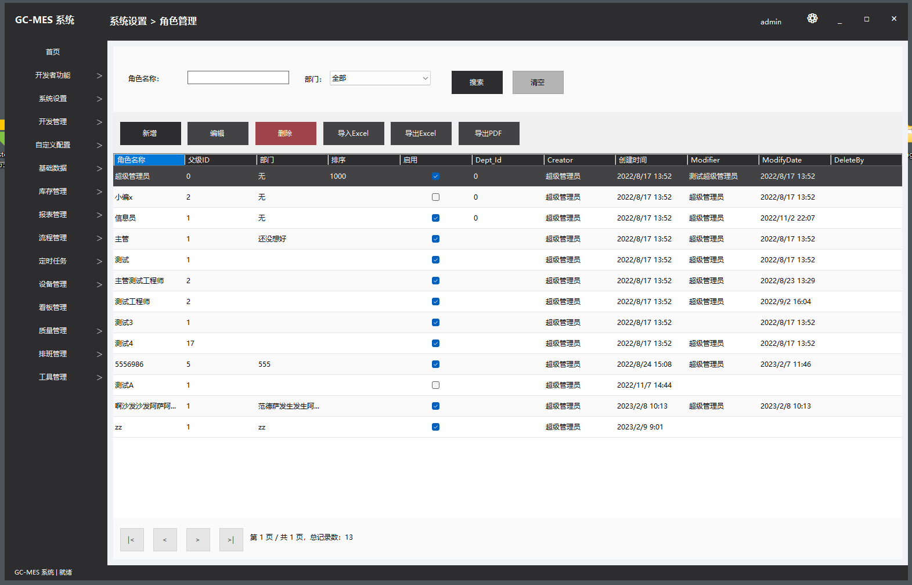

# GC-MES - Manufacturing Execution System

## 项目概述 (Project Overview)

GC-MES 是一个基于 .NET Framework 开发的制造执行系统（Manufacturing Execution System），采用 WinForm 实现客户端界面，为制造业提供生产管理、过程控制、品质管理等功能。

这个项目是本人打算基于winform控件，生成一个美化版，完善版，能够自动生成各种代码的程序，但是梦想很丰满，还有很多功能没能实现。

希望能够大家提供一点帮助




主题切换


二级菜单样式


代码生成器


## 功能特点 (Features)

- 用户权限管理系统
- 部门管理
- 菜单管理
- 角色管理
- 字典管理
- 系统日志
- 版本管理与自动更新
- 代码自动生成功能

## 技术栈 (Technology Stack)

- 开发语言: C#
- UI 框架: WinForm
- 数据库访问: Entity Framework
- 项目类型: .NET Framework 应用程序

## 系统架构 (System Architecture)

```
MESByWinform.sln
│
├── GC-MES.WinForm            👉 表示层（UI 界面）
├── GC-MES.BLL                👉 业务逻辑层（服务类）
├── GC-MES.DAL                👉 数据访问层（数据库操作）
├── GC-MES.Model              👉 实体类（Model）
├── GC-MES.Common             👉 公共类库（工具类、配置、日志等）
├── GC-MES.Core               👉 核心功能（加密、扩展等）
└── GC-MES.Upgrade            👉 系统升级组件
```

## 项目结构 (Project Structure)

### GC-MES.WinForm
客户端界面实现，包含系统所有窗体和控件，是用户与系统交互的接口层。

### GC-MES.BLL
业务逻辑层，包含系统的业务规则和流程控制，负责协调各个组件的工作。

### GC-MES.DAL
数据访问层，负责与数据库的交互，包括数据的读取和写入。

### GC-MES.Model
实体模型层，定义了系统中使用的数据结构和对象。

### GC-MES.Common
公共类库，提供各种工具类和辅助功能，如导出功能（Excel、PDF）等。

### GC-MES.Core
核心功能模块，提供系统基础支持如安全加密等功能。

### GC-MES.Upgrade
系统升级模块，负责软件版本的检测和自动更新。

## 安装和配置 (Installation & Configuration)

1. 确保安装了 .NET Framework 运行时环境
2. 克隆或下载项目代码
3. 使用 Visual Studio 打开 MESByWinform.sln 解决方案文件
4. 恢复 NuGet 包依赖
5. 配置数据库连接（修改 App.config 中的连接字符串）
6. 编译并运行项目

## 开发和贡献 (Development & Contribution)

如需参与项目开发，请遵循以下步骤：

1. Fork 本仓库
2. 创建功能分支 (`git checkout -b feature/AmazingFeature`)
3. 提交更改 (`git commit -m 'Add some AmazingFeature'`)
4. 推送到分支 (`git push origin feature/AmazingFeature`)
5. 创建 Pull Request

## 联系方式 (Contact Information)

如有任何问题或建议，请通过以下方式联系我们：

- 项目维护者：[维护者姓名/团队]
- 电子邮件：[联系邮箱]